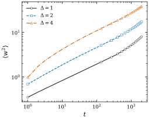
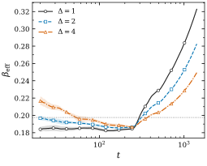
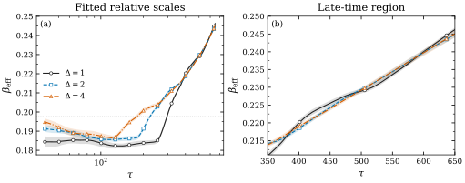
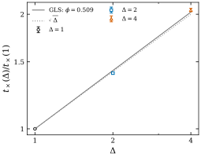

# Cylindrical VLDS Growth with the Conservative RSOS Model

## Overview

This project studies kinetic surface growth on an expanding cylindrical substrate using the **Conservative Restricted Solid-on-Solid (C-RSOS)** model, associated with the Villain–Lai–Das Sarma (VLDS), or nonlinear molecular beam epitaxy, universality class. It preserves the historical implementation and provides a tested modular C version with a configurable height restriction $\Delta$.

The current evidence shows finite-time drift and an approximate late-time crossover collapse. Neither the asymptotic growth exponent $\beta_\infty$ nor the spatial roughness exponent $\alpha_{\mathrm{roughness}}$ has been established by these simulations.

## Scientific model

The height field lives on a two-dimensional lattice with periodic neighbors in both directions. The implementation represents cylindrical expansion by keeping $L_x$ fixed and growing $L_y$ through duplication of a randomly chosen column. A new column is appended in memory and inserted beside its parent in the **physical neighbor ring**; memory order is not spatial order along $y$.

A deposition event selects a random site. If increasing its height by one would violate $|h_i-h_j|\leq\Delta$ for any nearest neighbor, the particle performs a nearest-neighbor random walk until deposition is allowed. It is not discarded. Expansion events duplicate the whole selected column.

With $N=L_xL_y$, each deposition/expansion event advances time by

$$\Delta t=\frac{1}{L_xL_y+\Omega}.$$

Deposition is selected with nominal probability $N/(N+\Omega)$; expansion has rate approximately $\Omega$, so $\langle L_y(t)\rangle\simeq L_{y,0}+\Omega t$. Time is normalized by the current event rate, **not an absolute deposition counter**. The historical single-precision cast in the probability numerator is retained for numerical equivalence. Diffusion steps do not separately advance this clock.

The observables are mean height, $L_y$, central moments, squared width $W^2=\langle m_2\rangle$, skewness and excess kurtosis. In a scaling regime,

$$W^2\sim t^{2\beta},\qquad \beta_{\mathrm{eff}}=\frac12\frac{d\ln W^2}{d\ln t}.$$

## Repository structure

```text
legacy/     Unmodified historical implementation
src/        CLI, lattice, C-RSOS dynamics, RNG, observables, sampling, output
tests/      Seeded equivalence tests, trajectory instrumentation, public-file audit
figures/    Four selected results, with captions and provenance
docs/       Equivalence, output definitions and publication review
Makefile    Build, reduced tests and clean targets
```

## Build and run

Requirements: a C11 compiler (tested with GCC and Clang), POSIX interfaces, `make`, and the system math library. Python 3, with **no third-party packages**, runs the tests.

```bash
make
make test
make test-sanitize  # optional: AddressSanitizer / UndefinedBehaviorSanitizer
```

Equivalent manual compilation:

```bash
cc -O2 -std=c11 -Wall -Wextra -Wpedantic -fno-fast-math -ffp-contract=off \
  src/*.c -lm -o cylindrical-crsos
```

A small reproducible run:

```bash
./cylindrical-crsos --delta 2 --lx 16 --initial-ly 4 --max-columns 128 \
  --max-time 12 --samples 3 --seed 12345679 --output-dir example-run
```

The historical cases are parameter choices of the same executable:

```bash
./cylindrical-crsos --delta 1
./cylindrical-crsos --delta 2 --max-columns 4800
./cylindrical-crsos --delta 4 --max-columns 4800
```

These last commands retain **production-sized defaults** and are not quick tests. They are documented examples; preparing this repository did not run production simulations.

| Option | Default | Meaning |
|---|---:|---|
| `--delta` | 1 | Maximum allowed neighboring height difference |
| `--max-time` | 2000 | Final time; measurements at integer thresholds |
| `--samples` | 10 | Realizations accumulated by one process |
| `--lx` | 32768 | Fixed lateral length |
| `--initial-ly` | 4 | Initial expanding length |
| `--omega` | 1 | Expansion rate; zero disables expansion |
| `--max-columns` | 2800 | Storage capacity, not the instantaneous $L_y$ |
| `--seed` | Automatic | Positive odd integer ≤99999999; explicit seed enables replay |
| `--output-dir` | `output` | Run directory; existing result files are never overwritten |

Automatic seeding retains the historical `/dev/random` odd-seed selection, with a local seed log. Use different seeds and directories for independent blocks. The RNG is single-process and not reentrant. `--help` lists the options; `make clean` removes build artifacts without deleting results.

Outputs are `deltaN-LySize.dat`, `deltaN-MethodA.dat`, `deltaN-Bkappa.dat`, `deltaN-Bm.dat` and `deltaN-run.txt`. The run record includes parameters, seed and event counts. See [output definitions](docs/OUTPUTS.md): **the legacy integer averaging of $L_y$ is intentionally preserved**, as are the stored moment formulas. Fixing that output convention would be a separate, explicitly versioned change.

## Code provenance

`legacy/CRSOS_Cylindrical_Concept.c` is an unmodified copy of the original scientific implementation used in the simulations.

It is byte-identical to the archived $\Delta=1$ source. Complete comparison found only $\Delta$, allocated column capacity and a final newline difference across the three archived variants; no dynamical or output-name differences were found. Historical results came from this implementation family, **not from the new refactor**.

`src/` separates responsibilities while preserving the random draws, operation order, precision conversions, deposition rule, expansion and measurements. Fifteen reduced seeded configurations for $\Delta=1,2,4$ produced byte-identical numerical outputs and identical measurement-time trajectory fingerprints under both GCC and Clang. The oracle uses temporary copies with explicitly documented parameter/seed substitutions; the preserved file is never edited. See [equivalence audit and SHA-256](docs/EQUIVALENCE.md).

## Historical simulation setup

The archived production setup used $L_x=32768$, $L_{y,0}=4$, $\Omega=1$ and $T_{\max}=2000$.

| Height restriction | Complete blocks | Realizations per block | Nominal realizations |
|---|---:|---:|---:|
| $\Delta=1$ | 20 | 10 | 200 |
| $\Delta=2$ | 20 | 10 | 200 |
| $\Delta=4$ | **12** | 10 | **120** |

The archived analysis directories historically used the labels S1, S2 and S4 for these parameter cases. Reconstruction used block moments before forming global ratios. Time points are correlated; reported errors use whole-block variability/jackknife, not temporal resampling.

A later audit clarified the estimator names: historical `MethodC` computes $B_m$ **within each block**, historical `MethodB` computes $B_\kappa$, and the true method C of the averaging reference cannot be reconstructed exactly from the archived summaries. Averaging block ratios does not generally recover the corresponding global moment ratio. [Definitions and limitations](docs/OUTPUTS.md).

## Main results

**Observed finite-time drift.** The following are finite-time effective growth exponents from fits of $\ln W^2$ against $\ln t$, dividing the slope by two. They are **not estimates of $\beta_\infty$**.

| Time window | $\Delta=1$ | $\Delta=2$ | $\Delta=4$ |
|---|---:|---:|---:|
| 50–200 | 0.1836 | 0.1878 | 0.1918 |
| 200–2000 | 0.2628 | 0.2387 | 0.2196 |
| 1000–2000 | 0.3228 | 0.2826 | 0.2494 |
| 1800–2000 | 0.3628 | 0.3138 | 0.2724 |

<p align="center">
  
  
</p>

**Conditional late-time collapse.** Relative scales from an uncertainty-weighted collapse over $\tau=t/s_\Delta\in[350,600]$, with $s_1=1$, are

$$s_2=1.3977\pm0.0085,\qquad s_4=2.049\pm0.021.$$

A direct $s_\Delta=\Delta^\phi$ fit gives $\phi\approx0.5074$ (conditional jackknife SE 0.0066), while derivative/window sensitivity spans approximately $0.478\lesssim\phi\lesssim0.539$. The late-time crossover scale is compatible with an approximate $t_\times\propto\sqrt{\Delta}$ dependence, but the available $\Delta=1,2,4$ data are insufficient to establish an exact power law. In particular, covariance-aware fits to the independently optimized ratios show residual lack of fit even with a free power.

<p align="center">
  
</p>

The weighted dispersion cost falls by approximately **99.53%**. $W^2$ also aligns better after time and amplitude rescaling, but skewness and kurtosis are not described by the same scale with comparable success. This supports a common crossover **only partially**; structured residuals remain, and collapse does not determine $\beta_\infty$.

<p align="center">
  
</p>

The last figure shows the reproduced **unweighted baseline** ratios 1:1.4011:2.0516 and a GLS fit, distinct from the weighted direct-fit estimates above. [All figure captions and provenance](figures/README.md).

## Limitations

- Only three $\Delta$ values and finite observation times are available. A visually strong late collapse is neither an exact dynamical equivalence nor proof of universality.
- The reference $\beta=0.19753$ is numerically near the early/intermediate regime. **The present simulations do not establish it as the asymptotic growth exponent.**
- Conditional roughness candidates become more coherent at equivalent crossover stages, but determining $\alpha_{\mathrm{roughness}}$ requires independent spatial validation. It must not be confused with a temporal correction exponent $p_{\mathrm{corr}}$.
- Legacy Ly truncation, fixed storage capacity and historical floating-point conversions remain documented compatibility constraints. Undefined normalized moments at zero width are not regularized silently.
- This public snapshot reproduces the implementation and reduced equivalence tests. Raw data, the complete analysis workspace, reference PDFs and the IC report remain local and are excluded from Git. The selected historical figures cannot be regenerated from this snapshot alone.

## Research context

The project originated in an undergraduate research project (*Iniciação Científica*) at the **Departamento de Física, Centro de Ciências Exatas e Tecnológicas, Universidade Federal de Viçosa (UFV), Brazil**, under the **Edital PIBIC FAPEMIG 2023–2024**, supported through FAPEMIG. The report is titled *Crescimento de Interfaces Bidimensionais com Geometria Cilíndrica*, by **Amir Bachar Saadeddine**, supervised by **Prof. Dr. Tiago José de Oliveira**. Its cover is dated **2025**; this is distinct from the call period. Subsequent audits refined the interpretation of the original results.

## References

1. I. S. S. Carrasco and T. J. Oliveira, “Universality and dependence on initial conditions in the class of the nonlinear molecular beam epitaxy equation,” *Physical Review E* **94**, 050801(R) (2016). [DOI: 10.1103/PhysRevE.94.050801](https://doi.org/10.1103/PhysRevE.94.050801). C-RSOS, VLDS scaling and expanding substrates.
2. T. J. Oliveira, “Height distributions in interface growth: The role of the averaging process,” *Physical Review E* **105**, 064803 (2022). [DOI: 10.1103/PhysRevE.105.064803](https://doi.org/10.1103/PhysRevE.105.064803). Estimator definitions and width fluctuations.

## License

This project is licensed under the BSD 3-Clause License (SPDX: `BSD-3-Clause`). See [LICENSE](LICENSE) for details. [Local publication review](docs/PUBLICATION_REVIEW.md).
